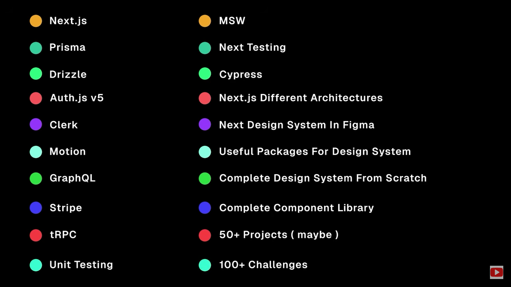
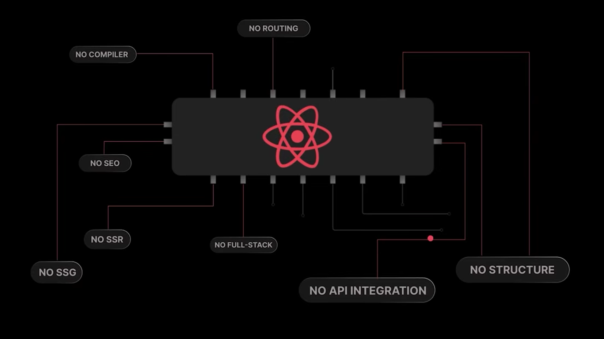
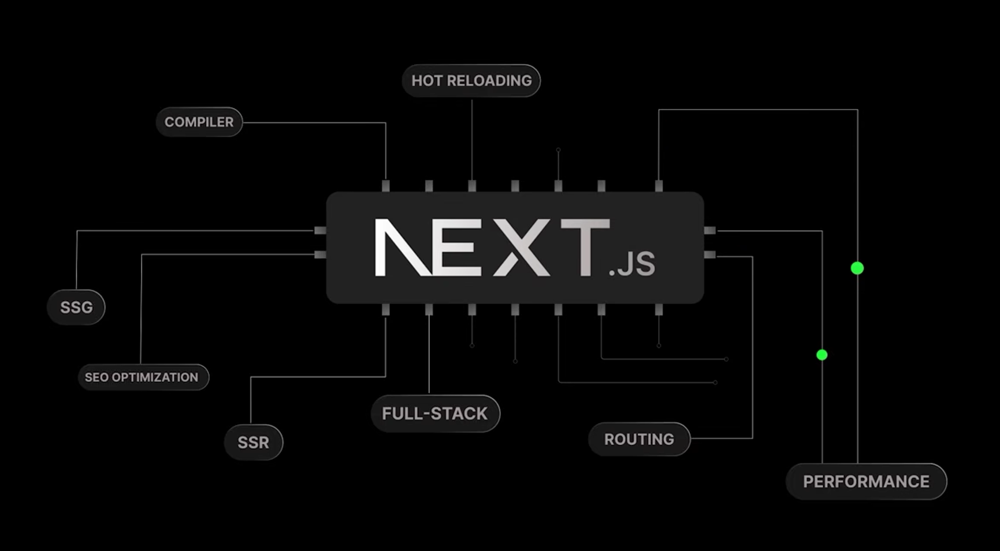

# 📘 Next.js Course – Introduction

---

## ❓ What is Next.js?

**`Answer:`** Next.js is a open-source react framework that makes it easier to built fast and scalable web applications. It provides a lot of built-in features like `SSR`, `SSG`, `API Routes`, and `automatic code splitting` all of which help with `performance` and `SEO`.

---

## ❓ Problem with React.js.

**Answer:**

React is a great library for building user interfaces but there are few things it does not handle out of the box.

>**`1.` `Client-side rendering`** loads a blank page initially and then fetches the content via JavaScript. 

>**`2.` `Client-side rendering`** loads a blank page initially and then fetches the content via JavaScript.

>**`3.` `Client-side rendering`** loads a blank page initially and then fetches the content via JavaScript.

>**`4.` `Client-side rendering`** loads a blank page initially and then fetches the content via JavaScript.

---

## ✅ Tips

- Always start your questions with a `## ❓ Question X:` heading.
- Use `**Answer:**` to make it bold and clear.
- Use `>` for blockquote-style answers.
- Use `---` to separate entries visually.

## ❓ Question: What are the features of Next.js?

**Answer:**

> 1. Server-side rendering (SSR)
> 2. Static site generation (SSG)
> 3. API routes
> 4. Image optimization
> 5. File-based routing

